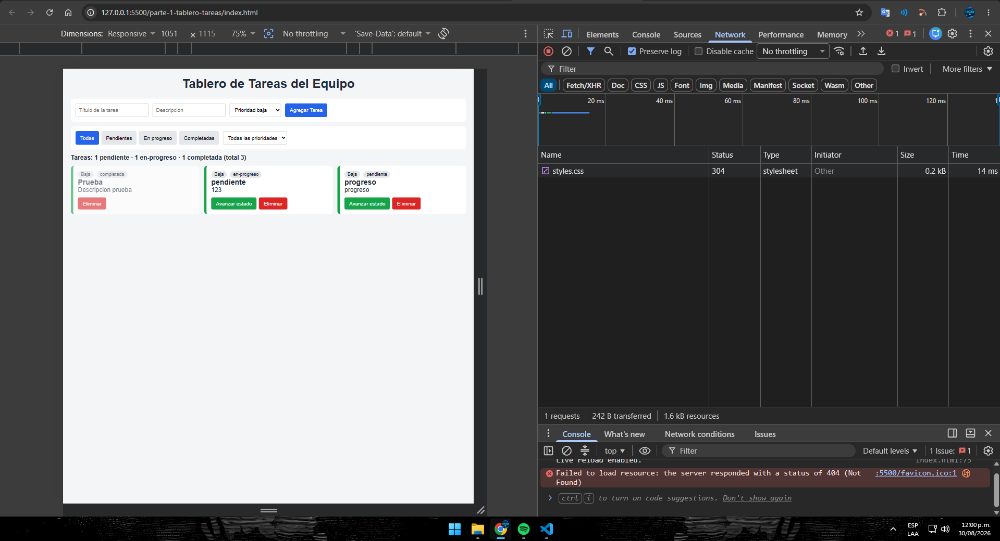
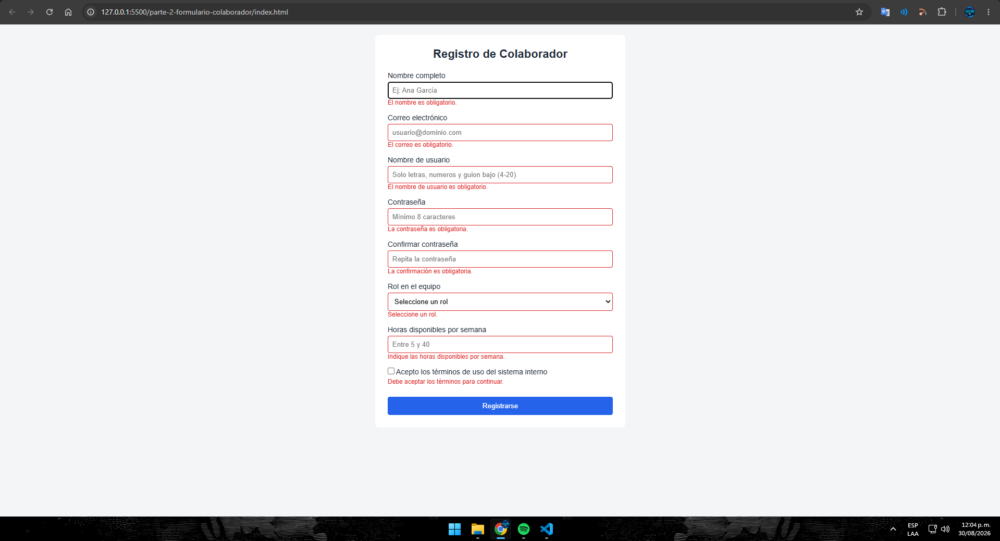
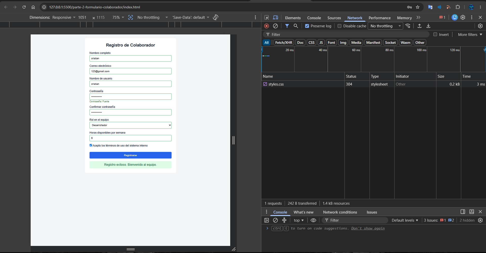

# Post-contenido — Unidad 4: JavaScript Básico

## Descripción
Repositorio del laboratorio de la Unidad 4 de Programación Web.
Contiene dos partes: tablero de tareas del equipo con manipulación
del DOM y eventos (parte-1-tablero-tareas/) y formulario de registro
de colaborador con validación manual y Constraint Validation API
(parte-2-formulario-colaborador/).

## Parte 1 — Tablero de tareas del equipo
Tablero en JavaScript puro: creación, avance de estado y eliminación
con un único listener delegado (data-action), filtrado combinado por
estado y prioridad, switch para la apariencia por prioridad, y
estadísticas con reduce() y for...of.

## Parte 2 — Formulario de registro de colaborador
Formulario con validación completa del lado del cliente: username
con pattern, campo condicional "equipo a cargo" (solo rol Líder),
horas validadas con rangeUnderflow/rangeOverflow, checkbox de
términos por .checked, control del evento submit e indicador de
fortaleza de contraseña.

## Decisiones de diseño

### Parte 1 — Generador de ID
Se eligió la Estrategia A (closure/módulo). El contador de IDs queda
encapsulado dentro de `crearGeneradorId()` y solo es accesible a
través de la función que devuelve, por lo que ningún otro punto del
programa puede leerlo ni reasignarlo por error, a costa de un poco
más de código que la variable global simple.

### Parte 1 — Actualización del DOM al avanzar estado
Se eligió la Estrategia A (actualización dirigida). Al avanzar el
estado de una tarea se localiza únicamente su nodo con querySelector
y se actualizan su clase y su badge, sin reconstruir el resto del
tablero, lo que resulta más eficiente para esta escala del proyecto.

### Parte 2 — Validación de contraseña
Se eligió la Estrategia B (validaciones independientes encadenadas).
Cada regla (mayúscula, número, carácter especial) se valida por
separado con su propio mensaje, de forma que el usuario sabe
exactamente qué le falta en vez de recibir un mensaje genérico.

### Parte 2 — Campo condicional "equipo a cargo"
Se eligió la Estrategia A (alternar el atributo required nativo). En
el listener de "change" de #rol se asigna
`document.querySelector("#equipo").required = esLider`, de modo que
checkValidity() y validity.valueMissing reflejan automáticamente si
el campo aplica, aprovechando la Constraint Validation API tal como
está diseñada.

## Cómo visualizar el proyecto
1. Clonar el repositorio: `git clone [URL-del-repo]`
2. Abrir la carpeta en Visual Studio Code
3. Clic derecho en index.html (de cada parte) → "Open with Live Server"

## Capturas de pantalla

